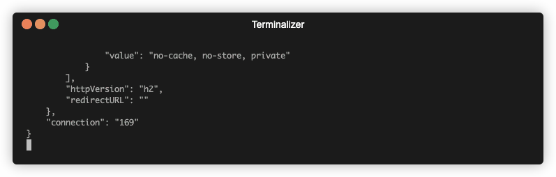

# Description

iOS devices contain a hidden feature for sniffing HTTP/HTTPS traffic from all processes using the CFNetwork framework
into an HAR format. To trigger this feature on a jailbroken device, you can simply place the correct configuration
for `com.apple.CFNetwork` and trigger the `com.apple.CFNetwork.har-capture-update` notification.

This project is just a simple utility for using this feature.

# How to use

If you would like to build yourself using Theos, simply use `make package`.

I've already supplied with all the necessary binaries so you don't have to. You can just install the `.deb` file found
in the `packages` subdirectory, or use the compiled `bin/harlogger`.

After deploy, simply run on remote device:

```shell
# trigger monitor HTTP/HTTPS traffic for the next 120 seconds
harlogger 120

# or just trigger for infinity
harlogger --infinite
```

Now you can just run locally:

```shell
./remote_har_listener.py -o out.har
```

The output should look like:




