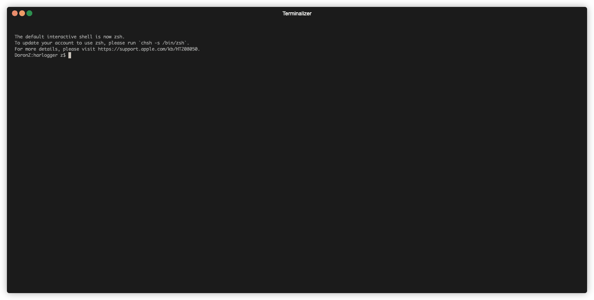

# Description

iOS devices contain a hidden feature for sniffing decrypted HTTP/HTTPS traffic from all processes using the CFNetwork
framework into
an [HAR](https://en.wikipedia.org/wiki/HAR_(file_format)#:~:text=The%20specification%20for%20the%20HTTP,Wide%20Web%20Consortium%20(W3C).)
format. To trigger this feature on a jailbroken device, you can simply place the correct configuration
for `com.apple.CFNetwork` and trigger the `com.apple.CFNetwork.har-capture-update` notification.

Since this capture triggers syslog lines, which can be associated with their producing image name
and pid, we can also connect each request-response to their corresponding process and the image
name which triggered it.

This project is just a simple utility for using this feature.

# How to use

If you would like to build yourself using [Theos](https://github.com/theos/theos/wiki), simply use `make package`.

I've already supplied with all the necessary binaries so you don't have to. You can just install the `.deb` file found
in the `packages` subdirectory, or use the compiled `bin/harlogger`.

After deploy, simply run on the remote device:

```shell
# trigger monitor HTTP/HTTPS traffic for the next 120 seconds
harlogger 120

# or just trigger for infinity
harlogger --infinite
```

Now you can just run locally:

```shell
./remote_har_listener.py -o out.har
```

When hitting the `Ctrl+C`, the script should exit and dump all captured entries into given 
output file, if any.

The output should look like:




